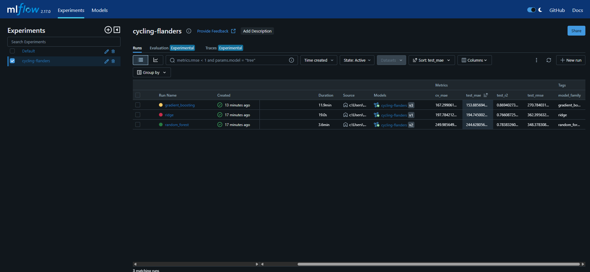
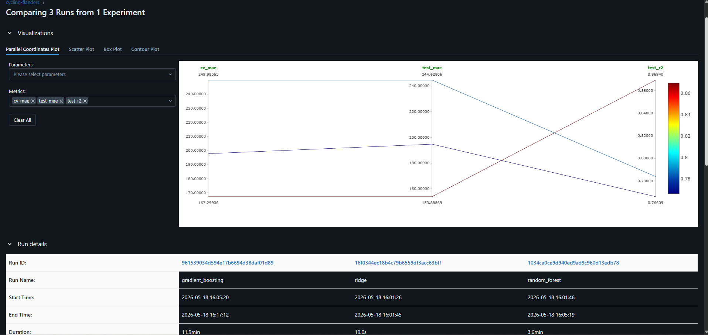
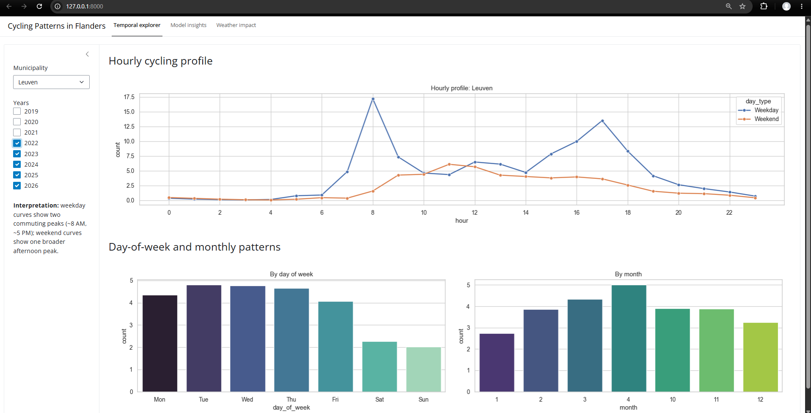
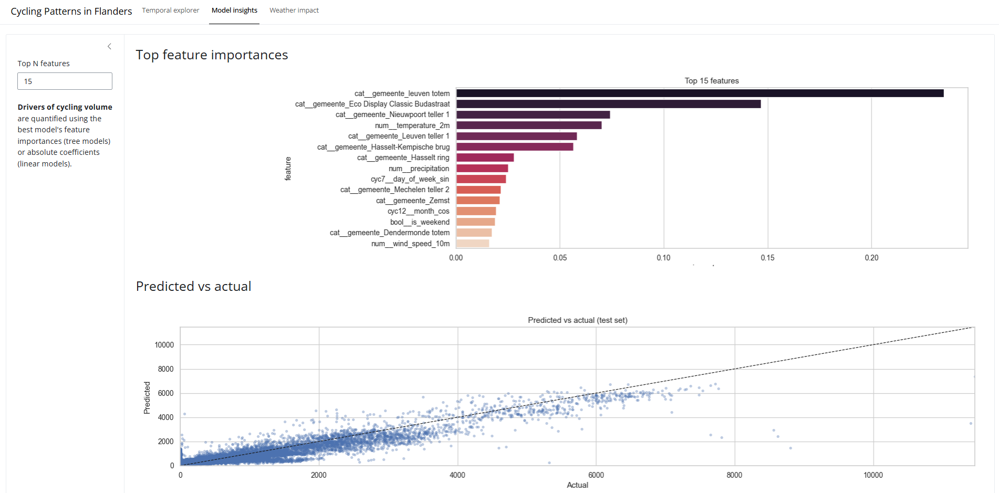
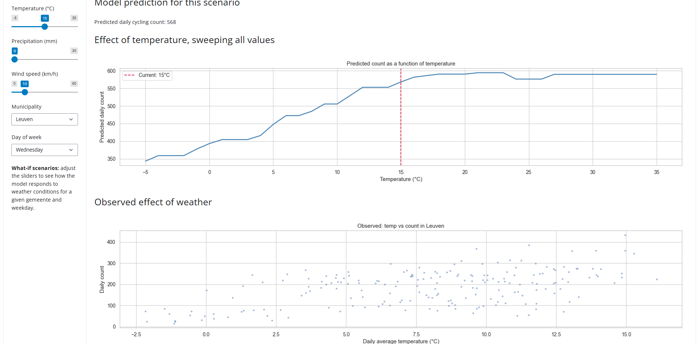
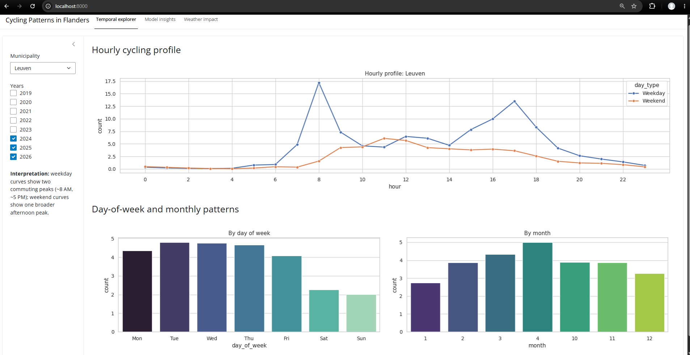
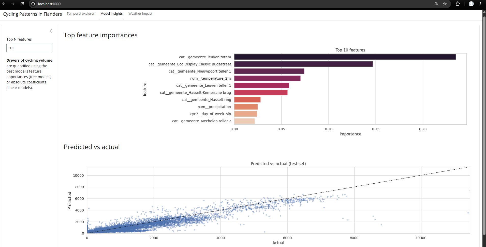
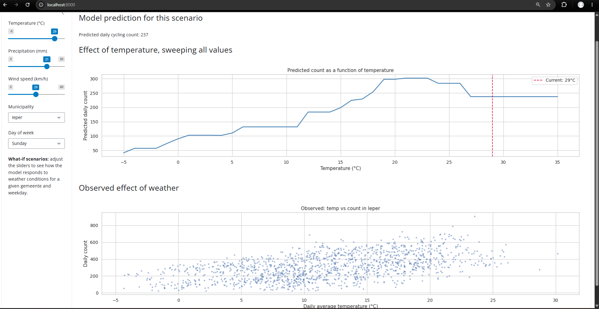
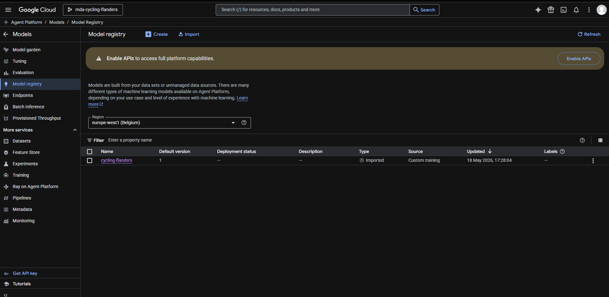
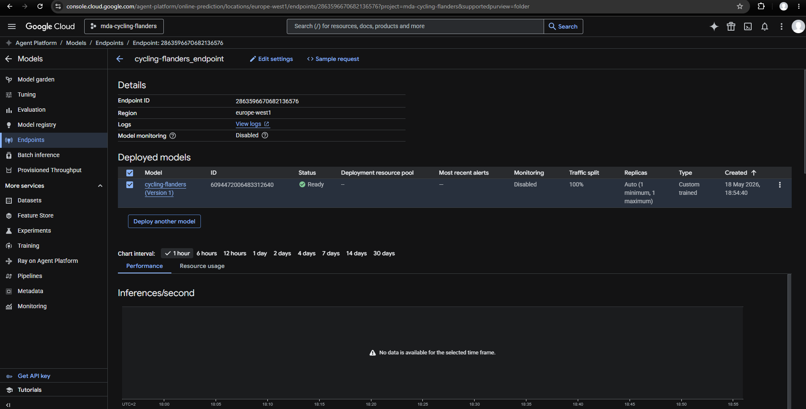

# Cycling Patterns in Flanders

Modern Data Analytics — Group 2 — KU Leuven

An exploratory analysis of cycling traffic in Flanders, combining automatic
bicycle counter data from the Agentschap Wegen en Verkeer (AWV) with weather,
calendar and spatial features. The model's feature importances and partial
dependences serve as the analytical backbone, and results are presented through
an interactive Shiny for Python dashboard.

## Research questions

1. **What drives cycling volume in Flanders?** Relative contribution of weather, temporal and location features to daily cycling counts.
2. **How do cycling patterns vary across time and space?** Peak times, seasonal trends, and variation across municipalities and counting sites.
3. **How sensitive is cycling to weather?** Marginal effect of one degree of temperature, one millimeter of rain, etc.

## Setup

```bash
pip install -r requirements.txt
python -m src.pipeline                       # download + clean + features + weather + daily aggregation
python -m src.training                       # train, compare, interpret, register best in MLflow
shiny run --reload --launch-browser app.py   # dashboard on http://localhost:8000
```

The `notebooks/` directory holds the original exploratory work and is
kept for reference. The `src/pipeline.py` and `src/training.py` modules
supersede them for reproducible runs.

Docker:

```bash
# Run the pipeline + training once so data/processed/ holds the parquets and best_model.pkl
python -m src.pipeline
python -m src.training

# Then build and serve
docker build -t mda-cycling .
docker run -p 8000:8000 mda-cycling
```

The Dockerfile is a two-stage build: stage 1 installs dependencies, stage 2
serves the Shiny app with the pre-baked artifacts from `data/processed/`. The
container doesn't retrain on each `docker build`, so iterating on the dashboard
or the Dockerfile itself is fast.

## Data

AWV bicycle count data (August 2019 onward), publicly available from
[opendata.apps.mow.vlaanderen.be](https://opendata.apps.mow.vlaanderen.be/fietstellingen/index.html).
Three linked CSVs: monthly counts, site metadata (with lat/lon), and direction
metadata. Enriched with daily weather observations from the Open-Meteo API and
Belgian public holidays.

## Repository structure

```
src/
  loaders.py         CSV readers for counts/sites/directions
  cleaning.py        filter to cyclists, hourly aggregation, outlier removal
  weather.py         Open-Meteo API integration
  features.py        cyclical time encoding, COVID periods, holidays, lat/lon
  modeling.py        ColumnTransformer + pipeline + temporal CV
  interpretation.py  permutation importance + partial dependence
  tracking.py        MLflow setup
  pipeline.py        end-to-end data pipeline (supersedes nb 01-02)
  training.py        end-to-end training + interpretation (supersedes nb 03)
  deploy_vertex.py   Google Cloud Vertex AI deployment (work in progress)
notebooks/           original exploratory notebooks (kept for reference)
app.py               Shiny dashboard (3 tabs)
Dockerfile           multi-stage build (deps -> training -> serving)
tests/               pytest smoke tests for features and modelling
```

## Methodology

**Feature engineering**
- Temporal: cyclical sin/cos encoding of day-of-week and month, rush-hour flags, weekend and holiday flags
- Calendar: five COVID periods (pre, first lockdown, summer, second lockdown, post)
- Spatial: WGS84 latitude/longitude per counting site
- Weather: temperature, precipitation, wind speed, cloud cover

**Modeling**
- ColumnTransformer with standardization for numerical features and one-hot encoding for categoricals
- Temporal train/test split (cutoff at the 80th percentile of dates)
- GridSearchCV with TimeSeriesSplit (5 folds)
- Four models compared via MLflow tracking

**Interpretation**
- Permutation importance (unbiased w.r.t. cardinality, unlike tree-built-in importance)
- Partial dependence plots for weather features (temperature, precipitation, wind)

## Results

Daily count prediction on a held-out temporal test set (last 20% of dates):

| Model                  | Test MAE | RMSE  | R²   |
|------------------------|---------:|------:|-----:|
| Ridge                  |   194.7  | 362.4 | 0.77 |
| Random Forest          |   244.6  | 348.4 | 0.78 |
| Gradient Boosting      |   153.9  | 270.8 | 0.87 |
| **HistGradientBoosting** |  **128.0** | **250.5** | **0.89** |

Best model: `HistGradientBoostingRegressor` with `max_depth=7`, `max_iter=500`,
`learning_rate=0.1`. Saved as `data/processed/best_model.pkl` and registered in
MLflow as `cycling-flanders`.

## Dashboard

Three tabs:

1. **Temporal explorer** — hourly profile, day-of-week and seasonal patterns per municipality
2. **Model insights** — top feature importances and predicted vs. actual scatter
3. **Weather impact** — what-if scenarios for temperature, precipitation and wind, with a partial-dependence plot showing the average effect of temperature across all sites

## Deployment

- Local: `shiny run app.py`
- Docker: see `Dockerfile`
- Google Cloud Vertex AI: see `src/deploy_vertex.py` (work in progress)

## Screenshots

MLflow UI:




Shiny dashboard:





Docker:





Vertex AI:



